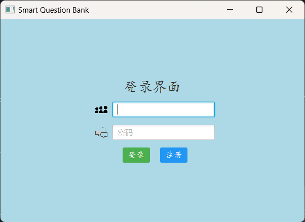
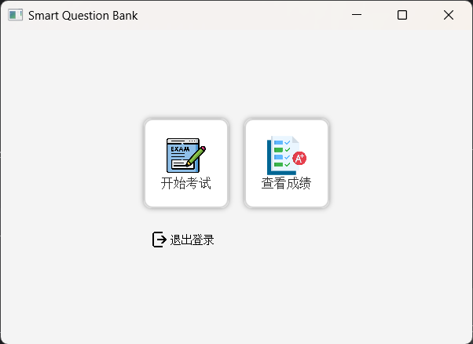
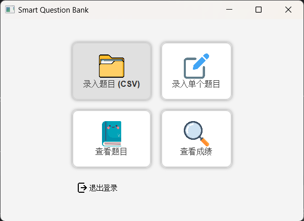
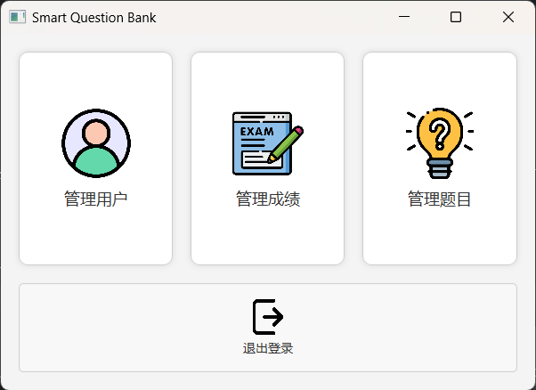

# 智卷阁

## 一、开发环境
项目在`IDEA`上进行开发，类型为`Maven`项目，在运行之前先到`pom.xml`更新`Maven`包。

界面设计使用了`JavaFX`库，`JavaFX API`与`Java SE`运行时环境`JRE`和Java开发工具包`JDK`绑在一起。开发时使用的版本为`jkd-1.8`，自带`JavaFX`，如果使用更高版本确保安装了相应的库。

## 二、文件说明

    ├─.idea
    ├─src
    │  ├─main
    │  │  ├─java    
    │  │  │  ├─controller       //控制
    │  │  │  ├─dao              //数据存储
    │  │  │  ├─model            //实体定义
    │  │  │  ├─service          //服务
    │  │  │  └─view             //图形化界面库
    │  │  └─resources           //problem.csv文件用于导入题库，而.dat结尾的文件为用户、题目和成绩数据库

## 三、运行测试
点击运行`Main`即可弹出注册和登录界面。

建议测试步骤如下

    1. 注册 professor 并登录(可以用回车)
    2. 从 `main/resources/problem-ch.csv` 导入数据(注意带ch后缀是中文题目)
    3. 录入单个题目测试
    4. 查看题目
    5. 教师端查看成绩并查看分析结果
    6. 注册 student 并登录
    7. 选择难度和题目数量进行测验，题目可以空着不写
    8. 学生端查看成绩并查看分析结果，并查看考试错题
    9. 登录管理员账号 admin
    10.删除用户注册记录、成绩记录和部分题目

已有数据的账号和密码如下，其中stu1的考试成绩最全

| 用户名     | 密码  |
|---------| --- |
| admin1  | 123456 |
| teacher1 | 123456 |
| teacher | 123 |
| student1 | 123 |
| student2 | 123 |
| student3 | 123 |
| stu1    | 123 |
## 四、开发日志
_20240608_

迭代一，包括智能出题、扩增题目和界面设计三个基本内容，此外还简要完成了选填批改和成绩统计。

_20240609_

增加了数据持久化存储，测试加入用户数据如下，含有多科目测试成绩，直接登录即可

_20240612_

完成管理员角色(admin)的基本功能，可以删除已经注册的用户、删除学生的测验成绩和删除题目。难度基本分类，可以选择题目的数量，增加了饼状图分析成绩和滚动查看成绩。

_20240613_

完成成绩柱状图分析，增加教师端查看成绩、分析以及单题目的录入功能，修复了成绩存储的BUG

_20240619_

更好看的登录界面、学生、管理员和教师界面，增加错题查看功能，可以查看错题和正确答案，其中错题会标红。*tips*——可以使用回车登录

_20240621_

用户界面图标、动画显示，完善取消注册退出功能，增加考试每道题2min计时，增加中文题库
<table>
    <tr>
        <td></td>
        <td></td>
        <td></td>
        <td></td>
    </tr>
</table>

_20240626_

更正中文题目数据库`problem-ch.csv`中部分遗漏的空格______导致的错误。